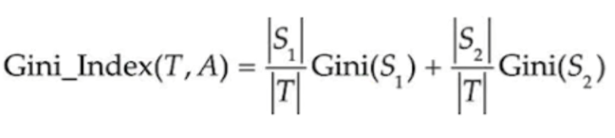

# Classification Tree

The CART algorithm is used to classify data by labels. It is a tree-based algorithm which means, that
it builds a tree structure to make predictions. The tree is built by splitting the data into 
subsets based on the values of the features. The algorithm chooses the feature and the value 
that best splits the data into two subsets. This process is repeated recursively until a stopping 
criterion is met, such as a maximum depth of the tree or a minimum number of samples in a leaf node.
It is considered one of the most popular and best algorithms for classification.

## Gini Impurity
To understand the CART algorithm, we first need to understand the concept of Gini Impurity.
Gini Impurity is a measure of how often a randomly chosen element from the set would be incorrectly labeled 
if it was randomly labeled according to the distribution of labels in the subset. The formula for Gini Impurity is the following:

where:
- \(p_k^2\) is the probability that two randomly drawn samples from the node are **both** class \(k\).
- \(\sum_k p_k^2\) is the probability that two random draws are the **same** class.
- So \(1 - \sum_k p_k^2\) is the probability the two draws are **different** classes: “impurity”.

### example
Suppose we have a node with 10 samples, where 6 belong to class A and 4 belong to class B. The probabilities are:
- p(A) = 6/10 = 0.6
- p(B) = 4/10 = 0.4

The Gini Impurity for this node would be calculated as follows:

Gini Impurity = 1 - (p(A)^2 + p(B)^2)

= 1 - (0.6^2 + 0.4^2)

= 1 - (0.36 + 0.16)

= 1 - 0.52

= 0.48

## Algorithm
The CART algorithm is a recursive binary tree structure that splits the data into subsets based on the Gini Impurity.
The algorithm continues to split the data until it reaches a stopping criterion.
The algorithm works as follows:
1. Choose the best feature and split point.
2. Recursively build the left and right subtrees.
3. Calculate the Gini Impurity for each subtree.
4. Choose the feature and split point that results in the lowest Gini Impurity.

In order to determine the best feature and split point, we use another algorithm for gini impurity which takes 2 arguments:

This formula returns the gini impurity for the given pair of subsets S1 and S2.
By testing every possible combination of features and split points, we can find the best feature and split point.

## Splitpoints with numerical values
The CART algorithm works best with categorical features but it can also be used with numerical features.
In this case, the algorithm iterates over all possible values of the feature and chooses the 
best split point for each value.